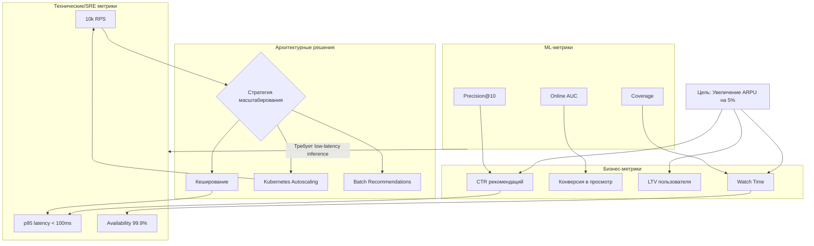

```mermaid
graph TD

    Goal["Цель: Увеличение ARPU на 5%"]

    %% Business
    subgraph Business ["Бизнес-метрики"]
        CTR["CTR рекомендаций"]
        Conv["Конверсия в просмотр"]
        LTV["LTV пользователя"]
        Watch["Watch Time"]
    end

    %% ML
    subgraph ML ["ML-метрики"]
        Prec["Precision@10"]
        Cov["Coverage"]
        AUC["Online AUC"]
    end

    %% Tech
    subgraph Tech ["Технические/SRE метрики"]
        Latency["p95 latency < 100ms"]
        RPS["10k RPS"]
        Avail["Availability 99.9%"]
    end

    %% Architecture
    subgraph Arch ["Архитектурные решения"]
        Dec{"Стратегия масштабирования"}
        Cache["Кеширование"]
        Scale["Kubernetes Autoscaling"]
        Batch["Batch Recommendations"]
    end

    %% Connections
    Goal --> CTR
    Goal --> LTV
    Goal --> Watch

    Prec --> CTR
    AUC --> Conv
    Cov --> Watch

    CTR --> Latency
    Watch --> Avail

    ML -- "Требует low-latency inference" --> Tech

    RPS --> Dec

    Dec --> Cache
    Dec --> Scale
    Dec --> Batch

    Cache --> Latency
    Scale --> RPS
```